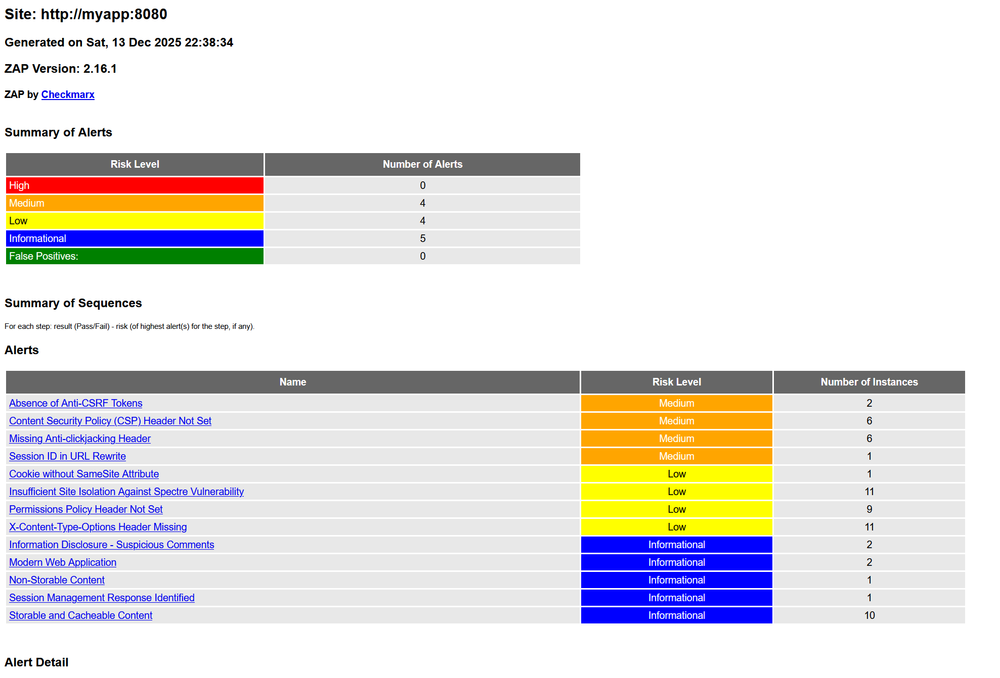

## Zadanie 3

Zgodnie z wymaganiami zadania 3 z README, utworzono workflow GitHub Actions (`.github/workflows/security-scan.yml`), który automatycznie wykonuje testy bezpieczeństwa przy każdym pushu do `main` i przy tworzeniu Pull Request.

Semgrep nie wykrył żadnych problemów bezpieczeństwa w kodzie źródłowym, natomiast Trivy znalazł 40 podatności w zależnościach Java. Raport z pełnymi wynikami skanowania jest dostępny pod [linkiem](https://github.com/jpocwiar/TBO4/actions/runs/20194926665).

## Zadanie 4

Zgodnie z wymaganiami zadania 4 z README, rozszerzono workflow o automatyczne uruchomienie aplikacji i skanowanie ZAP. Ponieważ napotkano trudne do rozwiązania błędy z architekturą (exec format error), zdecydowano się na pełną automatyzację w workflow GitHub Actions, gdzie środowisko działa poprawnie.

### Wyniki skanowania ZAP (DAST):

Skanowanie ZAP nie wykryło nowych krytycznych podatności, natomiast zidentyfikowało kilka ostrzeżeń (głównie dotyczących brakujących nagłówków bezpieczeństwa, braku ochrony przed CSRF oraz innych ustawień konfiguracyjnych). Wszystkie te problemy mają charakter średni lub niski i związane są głównie z konfiguracją aplikacji.

## Porównanie wyników SAST/SCA vs DAST

Każde z narzędzi wykrywa inne typy problemów: Trivy znalazł podatności w bibliotekach, Semgrep nie wykrył nic w kodzie, natomiast ZAP wskazał głównie braki w konfiguracji bezpieczeństwa aplikacji, jak brak nagłówków czy ochrony przed CSRF. Narzędzia te uzupełniają się i razem dają pełniejszy obraz bezpieczeństwa.

